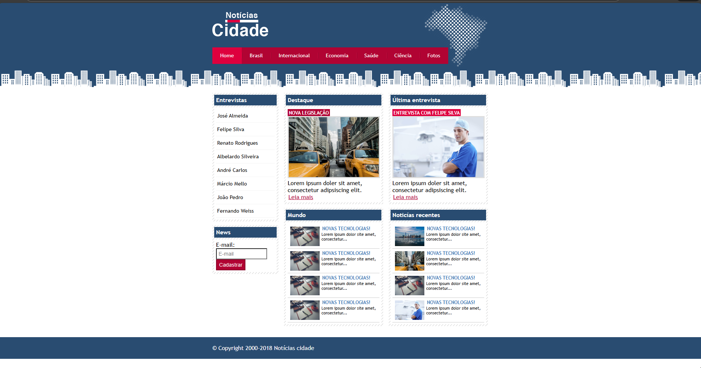
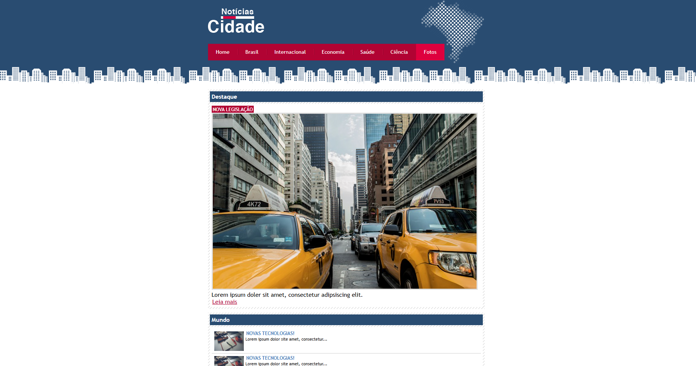

# Notícias Cidade 📰

Projeto de site de notícias desenvolvido com **HTML5 e CSS3**, simulando um portal informativo com layout profissional, navegação por categorias e organização em colunas.

---

## 📌 Sobre o Projeto
O **Notícias Cidade** é um projeto front-end desenvolvido durante um curso de Desenvolvimento Web, com o objetivo de praticar conceitos fundamentais de **HTML semântico**, **CSS para layout** e organização visual de conteúdo.

O site simula um portal de notícias, contendo seções como destaque principal, entrevistas, notícias recentes e páginas por categoria, como **Brasil** e **Fotos**.

Durante o desenvolvimento, foram realizados ajustes e melhorias para reforçar o aprendizado prático e a organização do projeto.

---

## 📷 Preview do Projeto

### 🏠 Home


### 🇧🇷 Brasil


### 📸 Fotos


---

## 🎓 Projeto de Curso
Este projeto faz parte de um curso de Desenvolvimento Web e foi utilizado como exercício prático para aplicar os conhecimentos adquiridos em:
- Estruturação de páginas com HTML
- Estilização e layout com CSS
- Organização de conteúdo em colunas
- Versionamento de código com Git e GitHub

---

## 🛠️ Tecnologias Utilizadas
- HTML5  
- CSS3  
- Git  
- GitHub  

---

## ✨ Funcionalidades
- Menu de navegação por categorias
- Layout em colunas
- Seção de destaque com imagem principal
- Lista de entrevistas
- Área de notícias recentes
- Páginas por categoria (**Home, Brasil e Fotos**)
- Estrutura organizada de arquivos

---

## 🚀 Como Executar o Projeto
1. Clone o repositório:
   ```bash
   git clone https://github.com/seu-usuario/noticias-cidade.git
